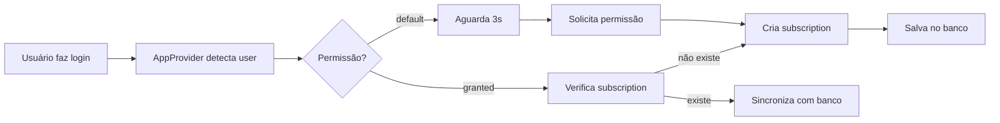
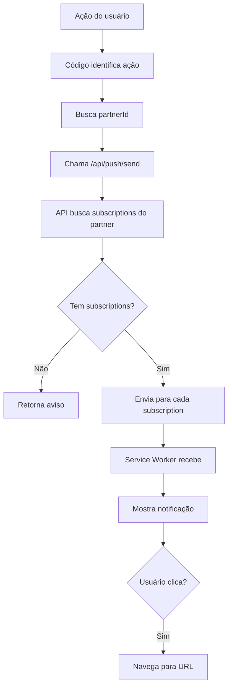
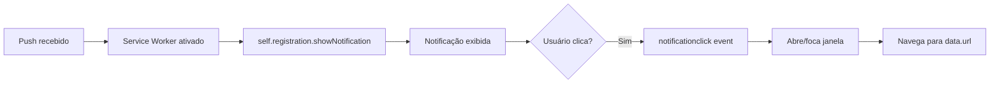

# 📱 Sistema de Notificações Push - Sindoca

## 📋 Índice
1. [Visão Geral](#visão-geral)
2. [Arquitetura](#arquitetura)
3. [Implementações Atuais](#implementações-atuais)
4. [Correções Aplicadas](#correções-aplicadas)
5. [Fluxo de Funcionamento](#fluxo-de-funcionamento)
6. [Configuração](#configuração)
7. [Possíveis Problemas](#possíveis-problemas)
8. [Recomendações](#recomendações)

---

## 🎯 Visão Geral

O Sindoca possui um **sistema completo de notificações push** implementado usando:
- **Web Push API** (padrão W3C)
- **VAPID** (Voluntary Application Server Identification)
- **Service Worker** para receber notificações em background
- **Supabase** para armazenar subscriptions
- **Next.js API Routes** para envio de notificações

### Status do Sistema: ✅ FUNCIONAL E COMPLETO

---

## 🏗️ Arquitetura

### Componentes Principais

```
┌─────────────────────────────────────────────────────────────┐
│                    CLIENTE (Browser)                         │
├─────────────────────────────────────────────────────────────┤
│  1. usePushNotifications Hook                                │
│     - Gerencia permissões                                    │
│     - Cria subscriptions                                     │
│     - Mostra notificações locais                             │
│                                                               │
│  2. AppProvider                                              │
│     - Auto-subscribe ao fazer login                          │
│     - Registra Service Worker                                │
│                                                               │
│  3. Service Worker (/public/sw.js)                           │
│     - Recebe push notifications                              │
│     - Mostra notificações                                    │
│     - Gerencia cache                                         │
└─────────────────────────────────────────────────────────────┘
                            ↓↑
┌─────────────────────────────────────────────────────────────┐
│                    SERVIDOR (Next.js)                        │
├─────────────────────────────────────────────────────────────┤
│  1. POST /api/push/subscribe                                 │
│     - Salva subscription no banco                            │
│                                                               │
│  2. DELETE /api/push/subscribe                               │
│     - Remove subscription do banco                           │
│                                                               │
│  3. POST /api/push/send                                      │
│     - Envia notificações via web-push                        │
│     - Remove subscriptions inválidas                         │
│                                                               │
│  4. lib/push/sendToPartner.ts                                │
│     - Helper para enviar para o parceiro                     │
└─────────────────────────────────────────────────────────────┘
                            ↓↑
┌─────────────────────────────────────────────────────────────┐
│                    BANCO DE DADOS                            │
├─────────────────────────────────────────────────────────────┤
│  push_subscriptions                                          │
│    - id (UUID)                                               │
│    - user_id (FK → auth.users)                              │
│    - endpoint (TEXT)                                         │
│    - keys (JSONB) → {p256dh, auth}                          │
│    - created_at, updated_at                                  │
│                                                               │
│  RLS Policies:                                               │
│    ✅ Users can only access their own subscriptions         │
└─────────────────────────────────────────────────────────────┘
```

---

## ✅ Implementações Atuais

### 1. **Adicionar Música** 🎵
- **Arquivo**: `app/api/spotify/playlist/add-track/route.ts` (linhas 174-215)
- **Quando**: Após adicionar uma música à playlist compartilhada
- **Mensagem**:
  - Título: "🎵 Nova música adicionada!"
  - Corpo: "[Nome da Música] - [Artista]"
- **Link**: `/musica`

### 2. **Adicionar Razão de Amor** ❤️
- **Arquivo**: `components/sections/LoveReasonsSection.jsx` (linhas 197-222)
- **Quando**: Após adicionar uma nova razão
- **Mensagem**:
  - Título: "[Nome] adicionou uma nova razão para te aguentar!"
  - Corpo: "Corre antes que [ele/ela] mude de ideia!"
- **Link**: `/razoes`

### 3. **Widget "Thinking of You"** 💭
- **Arquivo**: `components/widgets/ThinkingOfYouWidget.tsx`
- **Quando**: Em tempo real quando o parceiro envia uma mensagem
- **Mensagens**: Progressivas (10 níveis de intensidade)
- **Características**:
  - Máximo 10 cliques por dia
  - Cooldown de 2 horas entre envios
  - Mensagens humorísticas e escaláveis

### 4. **Upload de Fotos** 📸 (NOVO ✨)
- **Arquivo**: `hooks/useSupabasePhotos.jsx` (linhas 363-391)
- **Quando**: Após upload bem-sucedido de foto(s)
- **Mensagem**:
  - Título: "📸 Nova(s) foto(s) na galeria!"
  - Corpo: "Uma nova foto foi adicionada à galeria!" ou "[N] novas fotos foram adicionadas à galeria!"
- **Link**: `/fotos`

---

## 🔧 Correções Aplicadas

### 1. **Notificações para Upload de Fotos** (IMPLEMENTADO)

**Problema**: Não havia notificação quando fotos eram carregadas.

**Solução**: Modificado `hooks/useSupabasePhotos.jsx` para:
1. Armazenar `partnerId` durante inicialização
2. Enviar notificação push após upload bem-sucedido
3. Mensagem dinâmica baseada na quantidade de fotos

**Arquivos modificados**:
- `hooks/useSupabasePhotos.jsx`:
  - Adicionado import de `fetchJSON`
  - Adicionado `partnerIdRef` para armazenar ID do parceiro
  - Adicionada lógica de busca do parceiro no `initAuth`
  - Adicionado envio de push notification na função `uploadPhotos`

**Código adicionado**:
```javascript
// Send push notification to partner
if (partnerIdRef.current && results.length > 0) {
  try {
    const photoCount = results.length;
    const message = photoCount === 1
      ? 'Uma nova foto foi adicionada à galeria!'
      : `${photoCount} novas fotos foram adicionadas à galeria!`;

    await fetchJSON('/api/push/send', {
      method: 'POST',
      headers: { 'Content-Type': 'application/json' },
      credentials: 'include',
      timeout: 10000,
      body: JSON.stringify({
        recipientUserId: partnerIdRef.current,
        title: '📸 Nova(s) foto(s) na galeria!',
        body: message,
        icon: '/icon-192x192.png',
        tag: 'new-photo',
        data: { url: '/fotos' },
      }),
    });

    console.log('✅ Push notification sent for photo upload');
  } catch (error) {
    console.error('❌ Error sending push notification for photo:', error);
    // Don't throw - notification sending is non-critical
  }
}
```

---

## 🔄 Fluxo de Funcionamento

### 1. **Registro Inicial do Usuário**



### 2. **Envio de Notificação**



### 3. **Recebimento no Cliente**



---

## ⚙️ Configuração

### Variáveis de Ambiente

**Obrigatórias**:

```env
# VAPID Keys (geradas com web-push)
NEXT_PUBLIC_VAPID_PUBLIC_KEY=BJ7_jdvbDffFpqbFYzR6v3W0oOWuQQupXDN8_hIgbzcL2wcHn78m9YGxf-mUXUtOuVVdEQ-v3JufIcRK-yMnzxw
VAPID_PRIVATE_KEY=GiEnAt5XUlvaNdSmWsoadgurd8fKbyDT7X8h1zEHirE

# Internal API Secret (para chamadas server-to-server)
INTERNAL_API_SECRET=613d465ea141d05b6a79ec1dedaf660c9010437987a3ce1da55cef6981b2b9f4
```

**Recomendadas**:

```env
# URL do site (para produção)
NEXT_PUBLIC_SITE_URL=https://sindoca.vercel.app
```

⚠️ **Nota**: Se `NEXT_PUBLIC_SITE_URL` não estiver configurada, o sistema usa `http://localhost:3000` como fallback. Isso funciona em desenvolvimento, mas deve ser configurado em produção.

### Migração do Banco de Dados

O schema necessário está em:
- `supabase/migrations/010_add_push_subscriptions.sql`

Execute esta migração se ainda não estiver aplicada:

```sql
-- Criar tabela
CREATE TABLE IF NOT EXISTS push_subscriptions (
  id UUID PRIMARY KEY DEFAULT gen_random_uuid(),
  user_id UUID NOT NULL REFERENCES auth.users(id) ON DELETE CASCADE,
  endpoint TEXT NOT NULL,
  keys JSONB NOT NULL,
  created_at TIMESTAMPTZ DEFAULT NOW(),
  updated_at TIMESTAMPTZ DEFAULT NOW(),
  UNIQUE(user_id, endpoint)
);

-- RLS
ALTER TABLE push_subscriptions ENABLE ROW LEVEL SECURITY;

-- Policies
CREATE POLICY "Users can view own subscriptions"
  ON push_subscriptions FOR SELECT
  USING (auth.uid() = user_id);

-- (ver arquivo completo para todas as policies)
```

---

## ⚠️ Possíveis Problemas

### 1. **Notificações não chegam**

**Causas possíveis**:

✅ **Permissão não concedida**
- Verificar se usuário permitiu notificações no navegador
- Verificar em: Configurações do navegador > Notificações

✅ **Subscription não criada/salva**
- Verificar console do navegador para erros
- Verificar tabela `push_subscriptions` no Supabase

✅ **VAPID keys inválidas**
- Verificar se as keys estão corretas em `.env.local`
- Regenerar se necessário: `npx web-push generate-vapid-keys`

✅ **Service Worker não registrado**
- Abrir DevTools > Application > Service Workers
- Verificar se `/sw.js` está ativo

✅ **URL incorreta em produção**
- Adicionar `NEXT_PUBLIC_SITE_URL` nas variáveis de ambiente do Vercel

✅ **Subscription expirada/inválida**
- O sistema remove automaticamente subscriptions com erro 410/404
- Usuário precisa permitir notificações novamente

### 2. **Notificações duplicadas**

**Causa**: Múltiplas subscriptions para o mesmo usuário

**Solução**: A constraint `UNIQUE(user_id, endpoint)` previne isso, mas se necessário:
```sql
DELETE FROM push_subscriptions
WHERE id NOT IN (
  SELECT MAX(id)
  FROM push_subscriptions
  GROUP BY user_id, endpoint
);
```

### 3. **Erros de timeout**

**Causa**: `fetchJSON` tem timeout de 10 segundos

**Solução**: Já implementado - notificações são não-críticas e erros são logados mas não travam a aplicação.

---

## 💡 Recomendações

### 1. **Configuração de Produção**

```env
# Adicionar no Vercel/plataforma de deploy
NEXT_PUBLIC_SITE_URL=https://seu-dominio.com
```

### 2. **Monitoramento**

Adicionar tracking de:
- Quantas notificações são enviadas por dia
- Taxa de sucesso/falha
- Subscriptions ativas por usuário

Sugestão de tabela:
```sql
CREATE TABLE notification_logs (
  id UUID PRIMARY KEY DEFAULT gen_random_uuid(),
  sender_id UUID REFERENCES auth.users(id),
  recipient_id UUID REFERENCES auth.users(id),
  type TEXT, -- 'music', 'photo', 'reason', 'message'
  success BOOLEAN,
  error TEXT,
  created_at TIMESTAMPTZ DEFAULT NOW()
);
```

### 3. **Preferências de Notificação**

Permitir que usuários configurem:
- Tipos de notificações que desejam receber
- Horários silenciosos (Do Not Disturb)
- Sons e vibrações personalizadas

Sugestão de schema:
```sql
CREATE TABLE notification_preferences (
  user_id UUID PRIMARY KEY REFERENCES auth.users(id),
  enable_music BOOLEAN DEFAULT true,
  enable_photos BOOLEAN DEFAULT true,
  enable_reasons BOOLEAN DEFAULT true,
  enable_messages BOOLEAN DEFAULT true,
  quiet_hours_start TIME,
  quiet_hours_end TIME,
  updated_at TIMESTAMPTZ DEFAULT NOW()
);
```

### 4. **Fallback para Toast**

Já implementado parcialmente. Considerar sempre mostrar toast além da push notification para usuários que estão com o app aberto.

### 5. **Badge Count**

Adicionar contador de notificações não lidas:
```javascript
navigator.setAppBadge(unreadCount);
```

### 6. **Rich Notifications**

Expandir notificações com:
- Imagens (album cover, fotos)
- Ações inline (curtir, responder)
- Agrupamento por tipo

Exemplo:
```javascript
{
  title: 'Nova música',
  body: 'Song Name - Artist',
  icon: '/icon-192x192.png',
  badge: '/badge-icon.png',
  image: albumCoverUrl, // ← Adicionar
  actions: [           // ← Adicionar
    { action: 'like', title: '❤️ Curtir' },
    { action: 'view', title: '👀 Ver' }
  ],
  tag: 'music',
  renotify: false,
  requireInteraction: false
}
```

---

## 📊 Estatísticas Atuais

### Cobertura de Ações

| Ação | Status | Arquivo |
|------|--------|---------|
| Adicionar Música | ✅ | `app/api/spotify/playlist/add-track/route.ts` |
| Adicionar Razão | ✅ | `components/sections/LoveReasonsSection.jsx` |
| Thinking of You | ✅ | `components/widgets/ThinkingOfYouWidget.tsx` |
| Upload de Fotos | ✅ | `hooks/useSupabasePhotos.jsx` |
| Editar Razão | ❌ | - |
| Deletar Razão | ❌ | - |
| Favoritar Foto | ❌ | - |
| Achievements | ❌ | - |

### Componentes do Sistema

| Componente | Status | Arquivo |
|------------|--------|---------|
| Hook de Push | ✅ | `hooks/usePushNotifications.jsx` |
| API Subscribe | ✅ | `app/api/push/subscribe/route.ts` |
| API Send | ✅ | `app/api/push/send/route.ts` |
| Helper SendToPartner | ✅ | `lib/push/sendToPartner.ts` |
| Service Worker | ✅ | `public/sw.js` |
| Auto-subscribe | ✅ | `components/AppProvider.jsx` |
| Banco de Dados | ✅ | `supabase/migrations/010_add_push_subscriptions.sql` |

---

## 🧪 Testes Recomendados

### 1. Testar Permissões
- [ ] Usuário novo concede permissão
- [ ] Usuário novo nega permissão
- [ ] Usuário já com permissão concedida

### 2. Testar Envio
- [ ] Adicionar música → parceiro recebe
- [ ] Adicionar razão → parceiro recebe
- [ ] Upload 1 foto → parceiro recebe
- [ ] Upload múltiplas fotos → parceiro recebe
- [ ] Thinking of You → parceiro recebe em tempo real

### 3. Testar Navegação
- [ ] Clicar em notificação de música abre /musica
- [ ] Clicar em notificação de razão abre /razoes
- [ ] Clicar em notificação de foto abre /fotos

### 4. Testar Edge Cases
- [ ] Sem subscription → nenhum erro
- [ ] Subscription expirada → é removida automaticamente
- [ ] Múltiplas subscriptions (desktop + mobile)
- [ ] Timeout na API → não trava aplicação

---

## 📚 Referências

- [Web Push API](https://developer.mozilla.org/en-US/docs/Web/API/Push_API)
- [VAPID](https://datatracker.ietf.org/doc/html/rfc8292)
- [Service Worker](https://developer.mozilla.org/en-US/docs/Web/API/Service_Worker_API)
- [Notifications API](https://developer.mozilla.org/en-US/docs/Web/API/Notifications_API)
- [web-push library](https://github.com/web-push-libs/web-push)

---

**Última atualização**: 2025-11-11
**Status**: ✅ Sistema funcional e pronto para produção
